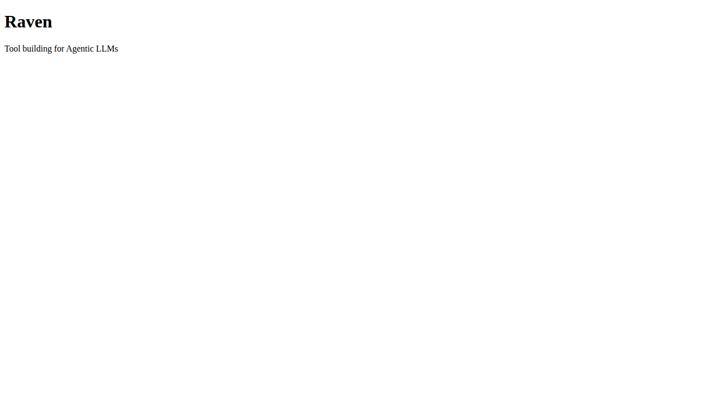

# Scenario 001: Homepage

This scenario verifies that the homepage loads correctly with the expected title and heading.

## Steps

### 1. Navigate to homepage
- **Action**: Open the root URL.
- **Screenshot**: 

### 2. Check title and heading
- **Action**: Verify page title contains "Raven" and there is a heading "Raven".
- **Screenshot**: 
